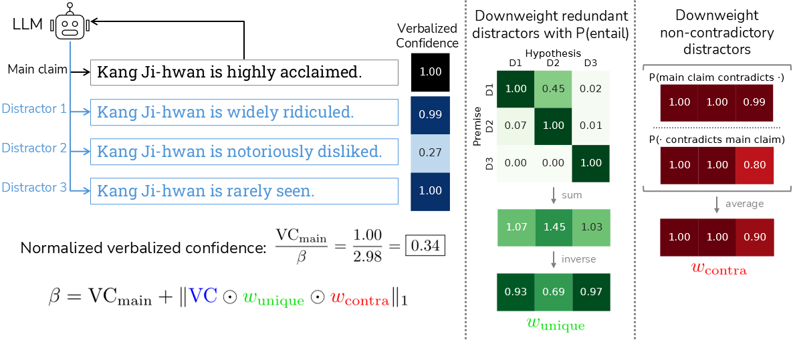

# [Calibrating Verbalized Confidence with Self-Generated Distractors](https://arxiv.org/abs/2509.25532)

Authors: [Victor Wang](https://dubai03nsr.github.io/), [Elias Stengel-Eskin](https://esteng.github.io/)



Normalizing verbalized confidence with DINCO. **(Left)** The LLM generates a claim along with several distractors and reports its confidences on them independently. To calibrate the main claim’s confidence, we divide it by β, the sum over each distractor’s confidence, weighted by uniqueness **(center)** and counterfactuality **(right)**.

## Abstract

Calibrated confidence estimates are necessary for large language model (LLM) outputs to be trusted by human users. While LLMs can express their confidence in human-interpretable ways, verbalized LLM-generated confidence scores have empirically been found to be miscalibrated, reporting high confidence on instances with low accuracy and thereby harming trust and safety. We hypothesize that this overconfidence often stems from a given LLM’s heightened suggestibility when faced with claims that it encodes little information about; we empirically validate this hypothesis, finding more suggestibility on lower-accuracy claims. Building on this finding, we introduce Distractor-Normalized Coherence (DINCO), which estimates and accounts for an LLM’s suggestibility bias by having the model verbalize its confidence independently across several self-generated distractors (i.e. alternative claims), and normalizes by the total verbalized confidence. To further improve calibration, we leverage generator-validator disagreement, augmenting normalized validator confidence with a consistency-based estimate of generator confidence. Here, we frame the popular approach of self-consistency as leveraging coherence across sampled generations, and normalized verbalized confidence as leveraging coherence across validations on incompatible claims, allowing us to integrate these complementary dimensions of coherence into DINCO. Moreover, our analysis shows that DINCO provides less saturated -- and therefore more usable -- confidence estimates, and that further sampling alone cannot close the gap between DINCO and baselines, with DINCO at 10 inference calls outperforming self-consistency at 100.

## Installation

We use Python 3.10. Dependencies can be installed with `pip install -r requirements.txt`.

## Usage

We provide implementations of DINCO, our confidence estimation method, on the datasets TriviaQA and FactScore (biography generation) for open-source models.

For TriviaQA, the command `bash triviaqa.sh` runs `dinco_triviaqa.py` to compute confidence estimates, `judge_triviaqa.py` to score candidate answers, and `evaluate_triviaqa.py` to compute calibration metrics. The model name can be specified to the Python programs with `--model_name`.

For FactScore, the command `bash factscore.sh` runs `dinco_factscore.py` to compute confidence estimates and `evaluate_factscore.py` to compute calibration metrics. The directory `factscore_claims` contains atomic claim decompositions (obtained from GPT-4.1) for the models `Qwen/Qwen3-8B` and `google/gemma-3-4b-it`.

## Pseudo-Beam Search

We implement pseudo-beam search in `pseudo_beam_search.py`, which we use to approximate beam search for API-access models that give logit access (e.g. GPT-4.1 and Gemini-2.5-Flash on SimpleQA). The example implementation is for the OpenAI API.

## Citation

```
@article{wang2025dinco,
      title={Calibrating Verbalized Confidence with Self-Generated Distractors},
      author={Victor Wang and Elias Stengel-Eskin},
      journal={arXiv preprint arXiv:2509.25532},
      year={2025}
}
```